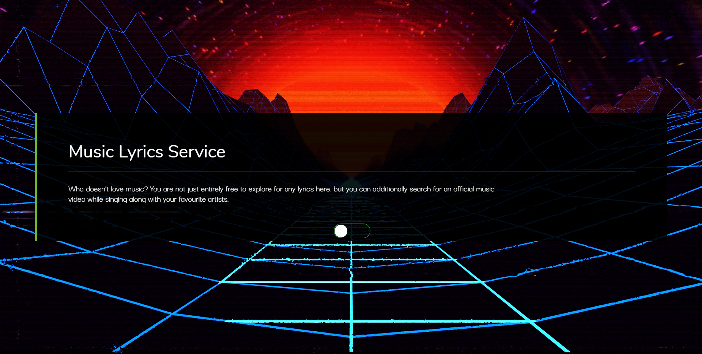
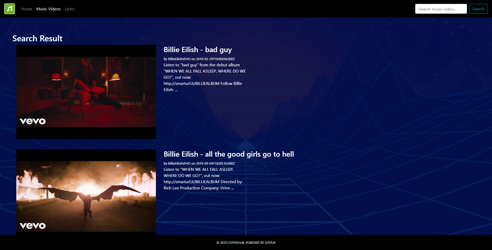
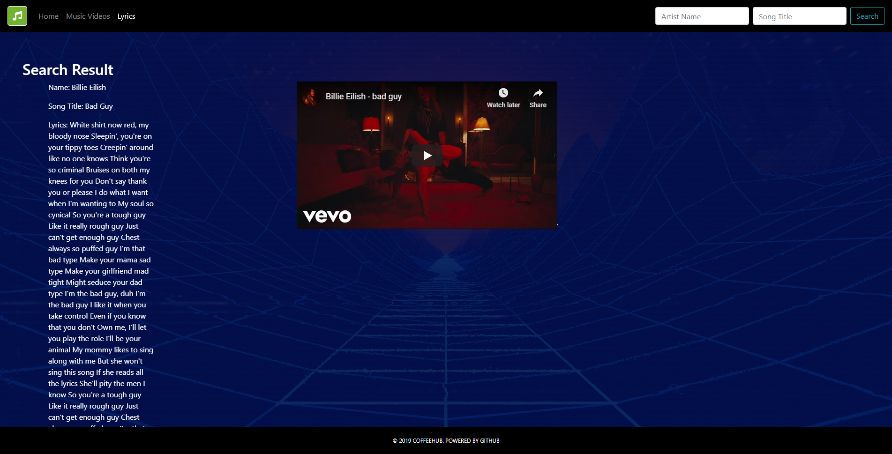


# MLS - Music Lyrics Service

Who doesn't love music? You are not just entirely free to explore for any lyrics here, but you can additionally search for an official music video while singing along with your favourite artists.

**Project Requirements:**

:white_check_mark: Use at least two APIs

:white_check_mark: Use AJAX to pull data

:white_check_mark: Use at least one new library or technology that haven't been learned

:white_check_mark: Create a polished front end/UI

:white_check_mark: Meet good quality coding standards (indentation, scoping, naming, etc)

:white_check_mark: Do NOT use alerts, confirms, or prompts

:white_check_mark: Incorporate some sor of repeating element (table, column, etc)

:white_check_mark: Use Bootstrap or an alternative CSS framework

:white_check_mark: Deploy site to Github Pages

:white_check_mark: Include user input validation


## :open_file_folder: Files
```
MLS
├─ .git
├─ assets
│ ├─ css
│ │ ├─ front.css
│ │ ├─ glitch-effect.css
│ │ ├─ jquery.fancybox.min.css
│ │ ├─ main.css
│ │ └─ search-result.css
│ ├─ images
│ │ └─ background-home.jpg
│ ├─ javascript
│ │ ├─ artyom.js
│ │ ├─ artyom.window.js
│ │ ├─ artyom.window.min.js
│ │ ├─ index.js
│ │ ├─ jquery.fancybox.min.js
│ │ ├─ kendell.js
│ │ ├─ lyrics.js
│ │ └─ main.js
│ └─ screenshots
│ ├─ img-0.png
│ ├─ img-1.png
│ └─ img-2.png
├─ index.html
├─ lyrics.html
├─ main.html
└─ README.md
```

## Technologies
- Bootstrap
- Google Fonts
- Fontawesome
- [Fancybox](https://fancyapps.com/fancybox/3/)
- JavaScript
  - jQuery
  - Momentjs
  - AJAX
- APIs
	- Youtube
	- Apiseeds

## Install
To clone this project to your device, type the `code` below to your git bash:
```bash
git clone https://github.com/itshally/MLS.git
```

Then, type the code to run the project:
```bash
start index.html
```

## Usage
I'm deploying it with Github Pages. 
Here is a guide for deploying it to Github Pages if ever you encountered some problems: 
:point_right: [How to effortlessly create a website for free with GitHub Pages (...)](https://towardsdatascience.com/how-to-create-a-free-github-pages-website-53743d7524e1)

## Screenshots
This is the view once the app starts running


For the **Music Videos** link, this is what it looks like after the user searched for an artist


Lastly for the **Lyrics** link, this is what it looks like after the user  searched for an ***artist*** and its ***song***.


## Demo
Click this [live preview](https://itshally.github.io/MLS/) to see this page.

## Authors / Team Members

[@itshally](https://github.com/itshally)  

[@chloieeeramos](https://github.com/chloieeeramos)

[@zcui1989](https://github.com/zcui1989)

[@KendellJeffrey](https://github.com/KendellJeffrey)
